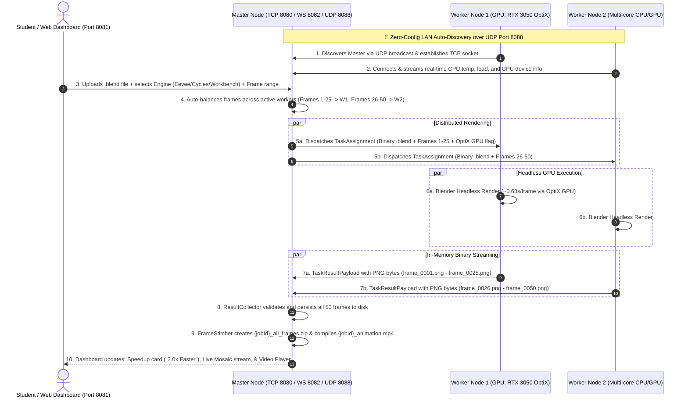

# 🎓 CampusGrid: Distributed Edge Computing Platform
### High-Throughput Distributed 3D Blender Edge Rendering Grid & Hardware Telemetry

<p align="center">
  
</p>

<p align="center">
  
  
  
  
  
</p>

---

## 📌 Overview

**CampusGrid** is a zero-cost distributed edge computing platform engineered to scavenge compute power from idle institutional lab computers and laptops without disrupting active student users.

In **Phase 2**, CampusGrid transforms connected computers into a high-performance **Distributed 3D Blender Edge Rendering Grid**. Users can upload any `.blend` project directly in the Web Dashboard. The platform automatically partitions frame sequences across connected worker nodes, distributes binary workloads over high-speed TCP sockets, executes headless GPU/CPU rendering, collects all rendered frames back to the Master Node, packages them into a **1080p MP4 animation video** and **ZIP archive**, and streams real-time telemetry, visual frame mosaics, and cluster speedup benchmark analytics.

---

## 🏗️ Phase 2 System Architecture



---

## ⚡ Core Features in Phase 2

### 🎮 1. Hardware GPU Acceleration (NVIDIA OptiX / CUDA, Apple Metal, AMD HIP)
* **Intelligent Auto-Detection**: [`GpuDetector.java`](file:///n:/New%20folder/CampusGrid/agent-node/src/com/campusgrid/agent/os/GpuDetector.java) queries host GPU drivers and certified Blender compute backends on worker startup.
* **Headless Acceleration**: [`BlenderJobExecutor.java`](file:///n:/New%20folder/CampusGrid/agent-node/src/com/campusgrid/agent/blender/BlenderJobExecutor.java) configures the fastest GPU device dynamically via Python expression (`OptiX` $\rightarrow$ `CUDA` $\rightarrow$ `HIP` $\rightarrow$ `Metal` $\rightarrow$ `CPU fallback`).
* **Performance**: Cycles render times dropped from **~30s/frame on CPU to ~0.63s/frame on RTX 3050 GPU (up to 23x speedup)**.

---

### 🛡️ 2. Self-Healing Fault Tolerance & Auto-Rescheduling
* **Watchdog Audit**: [`HeartbeatMonitor.java`](file:///n:/New%20folder/CampusGrid/master-node/HeartbeatMonitor.java) & [`WorkerRegistry.java`](file:///n:/New%20folder/CampusGrid/master-node/WorkerRegistry.java) detect node disconnections, power outages, or socket aborts within 15 seconds (or instantly upon socket drop).
* **Orphan Task Rescue**: [`JobManager.java`](file:///n:/New%20folder/CampusGrid/master-node/JobManager.java) immediately reclaims unfinished frame slices from the failed node, increments `retryCount`, and re-queues them with recovery priority.
* **Seamless Completion**: Active nodes pick up the orphaned slices automatically, ensuring jobs **never fail**.

---

### 📡 3. Zero-Configuration LAN Auto-Discovery (UDP 8088)
* **Master Beacon Daemon**: [`LanDiscoveryResponder.java`](file:///n:/New%20folder/CampusGrid/master-node/LanDiscoveryResponder.java) listens on UDP port `8088` and broadcasts periodic beacons across the local Wi-Fi subnet.
* **Auto-Connect**: Running `.\start-agent.bat` without arguments scans the LAN via [`LanDiscoveryClient.java`](file:///n:/New%20folder/CampusGrid/agent-node/src/com/campusgrid/agent/network/LanDiscoveryClient.java), resolves the Master IP, and connects in `< 500ms` without typing any IP address.

---

### 📊 4. "Cluster Speedup" Benchmark Analytics
* **Mathematical Metrics**: Computes cumulative sequential 1-PC execution time ($T_{\text{seq}} = \sum \text{sliceDuration}$) versus actual wall-clock cluster duration ($T_{\text{cluster}}$).
* **Performance Summary**: Renders a dedicated speedup benchmark card upon job completion:
  > 🚀 **Grid Acceleration: 2.0x Faster than 1 PC** `[Saved 7.0s / 49%]`  
  > Sequential 1-PC Est: `14.1s` ➔ **CampusGrid (2 Nodes): `7.0s`**

---

### 🎨 5. Live Frame-by-Frame Visual Mosaic Stream
* **Real-Time Filmstrip**: Embedded horizontal visual mosaic directly inside each job card in the Web UI.
* **Interactive Controls**: Pulsating live indicator dots during rendering, smooth hover zoom animations, frame sequence tags (`Fra 0001`), instant click-to-preview full resolution, and a locked-layout horizontal scrollbar.

---

### 🎛️ 6. Modern Web Dashboard & Quality Controls
* **Engine Selection**: Visual cards for **Eevee Next (Realtime)**, **Workbench (Instant Draft)**, and **Cycles (Path Tracing)**.
* **Sampling & Optimization**: Quick sample pills (`16`, `32`, `64`, `128`, `256`), AI Denoising toggle, resolution scaling (`100%`, `75%`, `50%`), and a dynamic cluster time estimator.
* **Direct Outputs**: 1-click **"📦 Download ZIP"** (raw PNG sequence) and **"▶ Play Video"** (embedded 1080p MP4 preview player).

---

### ⚡ 7. 1-Click Remote Headless Blender Installer
* If any connected PC is missing Blender, the Web UI displays `✖ Missing` with an orange **`⚡ Install`** button.
* Clicking **`⚡ Install`** remotely downloads and unpacks portable Blender 4.4.0 headless binaries into `./blender_bin/` on the remote machine with live progress tracking in the dashboard (`⏳ Installing 45%`).

---

## 📁 Repository Structure

```
CampusGrid/
├── agent-node/src/com/campusgrid/agent/
│   ├── Agent.java                          # Agent bootstrap with zero-config LAN discovery fallback
│   ├── blender/
│   │   ├── BlenderJobExecutor.java         # Headless Blender CLI executor with OptiX/CUDA & Python overrides
│   │   ├── BlenderInstaller.java           # Automated Blender 4.4.0 downloader & extractor
│   │   ├── BlenderRenderTask.java          # Serializable render task unit
│   │   └── ProgressReporter.java           # Real-time frame & FPS telemetry broadcaster
│   ├── network/
│   │   ├── LanDiscoveryClient.java         # UDP broadcast scanner for automatic Master detection
│   │   ├── MasterConnection.java           # Persistent TCP socket stream manager
│   │   ├── HeartbeatService.java           # Heartbeat sender with CPU temp, RAM, and GPU device info
│   │   └── PayloadListener.java            # In-memory PNG byte streaming & task receiver
│   └── os/
│       ├── GpuDetector.java                # Hardware GPU detection (NVIDIA OptiX/CUDA, Apple Metal, AMD HIP)
│       ├── IdleDetector.java               # Smart eviction listener (mouse/keyboard activity)
│       └── LinuxTelemetry.java             # Dynamic CPU thermals & OS load curve calculation
│
├── master-node/
│   ├── MasterNodeApplication.java          # Core orchestrator bootstrapping all 8 Master subsystems
│   ├── BasicScheduler.java                 # Non-blocking scheduler with dispatch timestamps & engine config
│   ├── DashboardServer.java                # Embedded HTTP REST API, WebSockets telemetry, & Speedup analytics
│   ├── FrameStitcher.java                  # Frame validator, video container unpacker, FFmpeg MP4 & ZIP bundler
│   ├── HeartbeatMonitor.java               # Watchdog daemon for dead node detection & socket cleanup
│   ├── Job.java                            # Thread-safe job model with duration metrics & requeue logic
│   ├── JobManager.java                     # Fault-tolerant task queue with auto-rebalancing
│   ├── LanDiscoveryResponder.java          # UDP 8088 auto-discovery beacon & responder daemon
│   ├── ResultCollector.java                # Asynchronous binary frame aggregator
│   ├── WorkerRegistry.java                 # Concurrent node state storage & orphan task rescue
│   ├── WorkerState.java                    # Thread-safe worker model (GPU, Temp, RAM, Job, Task)
│   └── web/
│       └── index.html                      # Neumorphic Web Dashboard with Live Mosaic & Speedup analytics
│
├── common-lib/src/
│   ├── GridMessage.java                    # Standard protocol envelope
│   ├── MessageType.java                    # Message enumerations (HEARTBEAT, TASK_ASSIGN, RESULT, etc.)
│   ├── TaskAssignmentPayload.java          # Workload payload with binary .blend and render parameters
│   └── TaskResultPayload.java              # Result payload containing binary PNG frame mappings
│
├── test/
│   ├── Phase2PipelineTest.java             # Full end-to-end distributed rendering test
│   ├── FaultToleranceRescheduleTest.java   # Node crash & auto-rescheduling simulation test
│   ├── GpuAndLanDiscoveryTest.java         # Hardware GPU detection & UDP discovery test
│   └── SpeedupAndMosaicTest.java           # Speedup benchmark calculation & mosaic stream test
│
├── build.bat                               # One-click compilation script
├── start-master.bat                        # One-click Master Node startup script
└── start-agent.bat                         # One-click Zero-Config Agent Node startup script
```

---

## 🚀 Quickstart Guide

### 📋 Prerequisites
* **Java**: JDK 17 or higher
* **Blender**: Blender 4.4.0 (included in `./blender_bin/` or auto-installed via Dashboard)
* **FFmpeg**: (Optional for video compilation; auto-detected if in system PATH or root)

---

### Step 1: Compile the Codebase
Run the unified build script from the repository root:
```cmd
.\build.bat
```

---

### Step 2: Start the Master Node
Start the Master Node Center (launches TCP port `8080`, Web Dashboard on `8081`, WebSockets on `8082`, and UDP Discovery on `8088`):
```cmd
.\start-master.bat
```
👉 Open **`http://localhost:8081/`** in your browser to access the Web Dashboard.

---

### Step 3: Start Worker Agent Nodes
On the same PC (in separate terminals) or on **any laptop/computer connected to the same Wi-Fi / LAN**:
```cmd
.\start-agent.bat
```
*(Zero-Config: The agent scans the local network, discovers the Master Node automatically, detects its GPU, and joins the rendering cluster in <500ms!)*

*(To connect manually to a specific IP, you can also run: `.\start-agent.bat 192.168.1.50`)*.

---

## 🧪 Automated Test Verification

CampusGrid includes four standalone integration test suites to verify system integrity:

```cmd
# 1. Full Multi-Node Distributed Rendering Pipeline
java -cp "bin;master-node/lib/*" Phase2PipelineTest

# 2. Self-Healing Fault-Tolerance & Auto-Rescheduling (Crash Simulation)
java -cp "bin;master-node/lib/*" FaultToleranceRescheduleTest

# 3. Hardware GPU Acceleration & UDP LAN Auto-Discovery
java -cp "bin;master-node/lib/*" GpuAndLanDiscoveryTest

# 4. Speedup Benchmark Analytics & Live Visual Mosaic Serialization
java -cp "bin;master-node/lib/*" SpeedupAndMosaicTest
```

---

## 🗺️ System Evolution Roadmap

| Phase | Core Objective | Status | Key Deliverables |
|---|---|---|---|
| **Phase 1** | CLI Core Infrastructure & CPU Harvesting | **Completed ✔** | Raw TCP sockets, thread pooling, scatter-gather math, Mandelbrot benchmarks, Smart Idle eviction via `xprintidle`. |
| **Phase 2** | Distributed 3D Blender Rendering Grid | **Completed ✔** | Web UI, binary streaming, GPU OptiX/CUDA acceleration, fault tolerance, UDP auto-discovery, live mosaic, Speedup benchmark, FFmpeg MP4. |
| **Phase 3** | Distributed AI / ML & General Compute | *Upcoming 🚀* | Distributed LLM inference slicing, MapReduce data pipelines, and heterogeneous cluster scheduling. |

---

## 👥 Authors & Contributors
* **CampusGrid Engineering Team** (Project Lead & Core Contributors)
* Repository: [GitHub - mkgoklani/CampusGrid](https://github.com/mkgoklani/CampusGrid)
